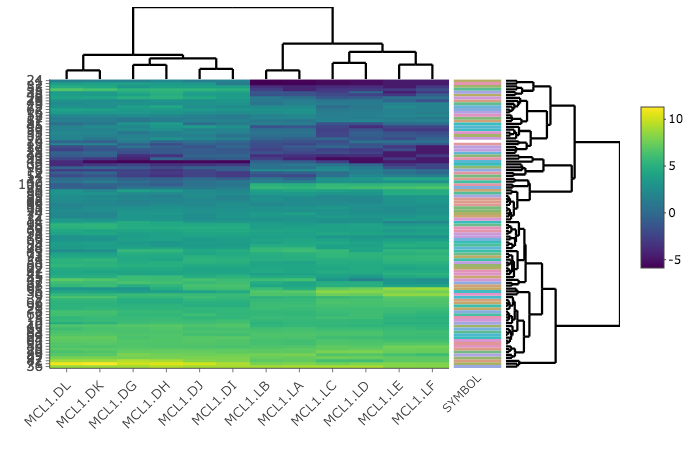

Heatmap
====
filename: README.md

## Quick Start

  - Open the binder and then click "knit"
  
## Example Output

## Summary

   - This visualization produces a clustered heatmap
   - Input: Log transformed normalized gene expression data
   - A heatmap enables you to look for similarities in expression profiles across samples.
 - For more info on heatmaply, go here:
 https://github.com/talgalili/heatmaply
 
## Authors

 - Cheryl Logan
 - github: clogan88 
 - ORCID: https://orcid.org/0000-0001-7639-4956

## Links

Zenodo Binder, doi: LINK_TO_BINDER

Github Binder: LINK_TO_BINDER

Github Repository: https://github.com/speeding-up-science-workshops/<REPO_NAME>